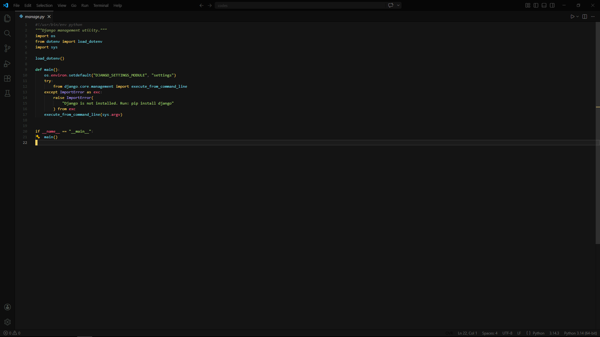

# ⚙️ VS Code Settings

<div align="center">


A zero-bloat, performance-tuned VS Code setup with aggressive UI cleanup, smart automation, and full control

[Features](#-features) • [Installation](#-installation) • [Configuration](#-configuration) • [Philosophy](#-philosophy)

</div>

---

## 📖 About

This is not a “pretty config”.

This is a **precision-tuned VS Code setup** built for:
- speed
- focus
- control
- real coding

No distractions. No useless UI. No hesitation.

---

## ✨ Features

- 🚀 **Performance Tweaks**
  - Minimap disabled
  - Breadcrumbs removed
  - Sticky scroll off
  - Reduced rendering load

- 🧠 **Smart Editing**
  - Auto format on save / paste / type
  - Auto closing brackets & quotes
  - Linked editing enabled
  - Multi-file highlight

- ⚡ **Fast Workflow**
  - Auto-save on window change
  - Mouse wheel zoom
  - Smooth cursor + scrolling

- 🎯 **Clean UI**
  - No minimap
  - No breadcrumbs
  - Minimal visual noise
  - Focus on code only

- 🔍 **Advanced Engine**
  - Tree-sitter enabled for multiple languages
  - Experimental parsing optimizations
  - Inline diff improvements

- 🔒 **Controlled Environment**
  - Workspace trust relaxed (open instantly)
  - Trusted JSON schema sources
  - No annoying confirmations

- 📴 **No Activity Tracking**
  - Discord RPC fully disabled
  - Idle tracking off
  - Status clean

---

## 📸 Preview



---

## 🚀 Installation

```bash
git clone https://github.com/toploardgg/mysettingvscode.git
```
Open VS Code config folder

Windows
```
C:\Users\YOUR_USERNAME\AppData\Roaming\Code\User
```
Linux
```
~/.config/Code/User
```
macOS
```
~/Library/Application Support/Code/User
```
Apply config

# Replace your settings.json

Open settings.json
Paste this config
Save

Done.
---
⚙️ Configuration Highlights-
Area	What’s Done
Editor	auto-format, smooth cursor, smart hints
UI	minimap OFF, breadcrumbs OFF, clean layout
Performance	reduced rendering + experimental engine
Input	auto-closing, multi-cursor control
Terminal	Cascadia Mono font
Theme	Bearded Theme Monokai Black
🧠 Philosophy

Focus > Features
Speed > Decorations
Control > Defaults

If it slows you down → it's disabled
If it distracts you → it's removed
If it helps → it's optimized
🔧 Notable Tweaks
editor.formatOnSave = true
files.autoSave = onWindowChange
editor.minimap.enabled = false
breadcrumbs.enabled = false
editor.smoothScrolling = true
editor.cursorSmoothCaretAnimation = on
editor.multiCursorLimit = 10
🐛 Troubleshooting

“Too minimal”

Good. That’s the point.

Missing features

Add manually, but expect performance loss

Something broke

Reset settings.json
📊 Performance
Startup: faster than default
RAM usage: reduced
UI load: minimal
Typing latency: smooth

---
📝 License
---
MIT License

👨‍💻 Author

toploardgg

https://github.com/toploardgg
